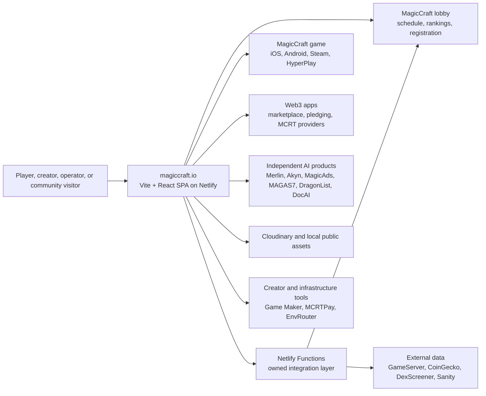
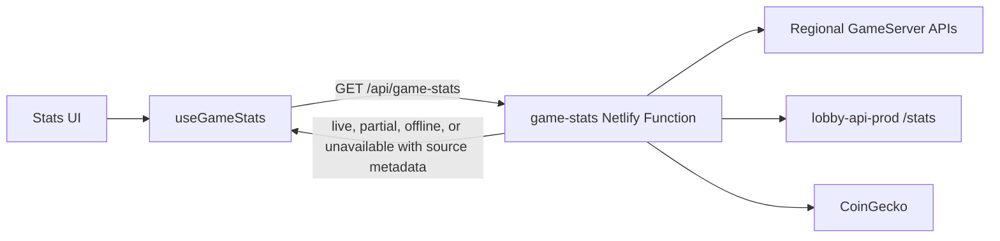

# MagicCraft website architecture

Last reviewed: 14 July 2026, Bangkok time

This document maps the system represented and integrated by the MagicCraft website. It distinguishes code owned by this repository from independent products and services. For day-to-day guardrails, read [AGENTS.md](AGENTS.md). For dated audit findings and unfinished work, read [the function sweep](docs/MAGICCRAFT_FUNCTION_SWEEP_TODO.md) and [the design plan](docs/MAGICCRAFT_DESIGN_CONCEPT_TODO.md).

## 1. Purpose and product model

`magiccraft.io` is the public entry point for the MagicCraft game and the studio's product ecosystem.

The website has two primary jobs:

1. Help a player understand and start the live MagicCraft game.
2. Help a visitor understand and open the studio's six focused AI products.

Supporting jobs include public game activity, rankings, Web3 lobbies, MCRT access and education, the marketplace and pledging handoffs, creator tools, news, the living whitepaper, programs, legal pages, and support.

The design north star is **Play the game. Put AI to work.** The game and AI suite are the main pillars. Web3 and MCRT are optional supporting systems, not prerequisites for the free game or the independent AI products.

## 2. System context



The arrows to external systems are handoffs or bounded reads. They do not mean this repository owns those systems.

## 3. Runtime layers

| Layer                  | Technology                                             | Main locations                                                                        | Responsibility                                                                             |
| ---------------------- | ------------------------------------------------------ | ------------------------------------------------------------------------------------- | ------------------------------------------------------------------------------------------ |
| Public client          | React 18, TypeScript, Vite                             | `index.html`, `src/main.tsx`, `src/App.tsx`, `src/pages/`, `src/components/`          | Document shell, routes, navigation, pages, accessibility, client state, external handoffs  |
| Styling                | Tailwind, global CSS, styled-components, Framer Motion | `src/index.css`, `src/App.css`, components                                            | Responsive layout, theme, animation, fixed shells                                          |
| Product data           | Typed TypeScript catalogs                              | `src/data/aiProducts.ts`, `src/data/ecosystemSystems.ts`, `src/data/gameplayMedia.ts` | Shared public product truth and media references                                           |
| Serverless integration | Netlify Functions                                      | `netlify/functions/`                                                                  | Secrets, bounded upstream reads, aggregation, cache/fallback logic, form and AI operations |
| Content                | Local TS data plus Sanity                              | `src/data/`, `src/lib/sanity/`, `sanity-studio/`                                      | Static copy, hero data, blog queries, hosted studio handoff                                |
| Static assets          | Netlify public assets plus Cloudinary                  | `public/`, external Cloudinary URLs                                                   | Logos, screenshots, video, icons, social images, contact page                              |
| Hosting and routing    | Netlify                                                | `netlify.toml`                                                                        | Build, redirects, rewrites, SPA fallback, headers and CSP                                  |
| SEO build step         | Node script                                            | `scripts/generate-route-shells.mjs`                                                   | Route-specific HTML metadata for priority routes                                           |
| Quality gate           | GitHub Actions, TypeScript, ESLint, Vitest             | `.github/workflows/ci.yml`, `src/test/`                                               | Type, lint, behavior, route, truth, and production-build checks                            |

## 4. Client boot and shared shell

`src/main.tsx` mounts the app inside `React.StrictMode` and `HelmetProvider`.

The root `index.html` is the active Vite document. It owns base metadata and structured data, Google Analytics, the hidden Google Translate mount, the deferred MagicAds script and reserved banner slot, and hidden Netlify form definitions. `src/index.html` is not the active Vite entry.

`src/App.tsx` owns:

- `BrowserRouter` and every client route.
- Lazy loading for page bundles.
- The shared `ScrollToTop` behavior.
- The global live-support widget.
- A development-only build revision badge.
- The client 404 page.

The header and drawer in `src/components/Header/Header.tsx` are the main discovery surface. They mix internal router destinations, external product handoffs, and device-aware actions. The footer repeats important discovery and policy paths. Mobile uses a fixed conversion bar, so page bottoms need enough safe spacing.

There is no central route layout. Individual pages mount their own Header and Footer combinations. A shared-shell change therefore needs a route inventory and rendered checks, not an assumption that every page inherited it.

The homepage in `src/pages/Homepagemcrt.tsx` composes these active sections in order:

1. Header
2. Hero with game and AI-suite entry paths
3. Game experience with first-party gameplay media
4. Live statistics with honest source states
5. Six-product AI suite
6. Grouped ecosystem systems
7. Final game or product choice
8. Mobile conversion bar
9. Footer

The page also emits Organization, ItemList, VideoGame, and VideoObject structured data.

## 5. Route inventory

The route component names below come from `src/App.tsx`. A public 200 response is not enough to prove the route's JavaScript-rendered purpose.

### Primary game and studio routes

| Route             | Component        | Purpose                                                               |
| ----------------- | ---------------- | --------------------------------------------------------------------- |
| `/`               | `Homepagemcrt`   | Balanced game and AI studio homepage                                  |
| `/magiccraft`     | `HomePageGames`  | Dedicated game overview, modes, media, heroes, and platform actions   |
| `/chooseyourhero` | `ChooseYourHero` | Hero roster                                                           |
| `/hero/:heroName` | `Hero`           | Hero detail by normalized slug                                        |
| `/hero`           | `Navigate`       | Redirect to the roster                                                |
| `/lobbies`        | `Lobbies`        | Read-only live schedule discovery plus official lobby handoff         |
| `/stats`          | `Dashboard`      | Source-backed lobby, market, and available game statistics            |
| `/dashboard`      | `Navigate`       | Legacy redirect to `/stats`                                           |
| `/leaderboard`    | `LeaderBoard`    | Handoff to the official public lobby leaderboard                      |
| `/server`         | `serverStatus`   | Honest service directory and status paths, not fabricated server logs |
| `/whitepaper`     | `Whitepaper`     | Living product, system, MCRT, limitation, and source guide            |

### Content and help routes

| Route         | Component             | Purpose                                                                                         |
| ------------- | --------------------- | ----------------------------------------------------------------------------------------------- |
| `/faq`        | `Support`             | Frequently asked questions and support handoffs                                                 |
| `/patch`      | `GamePatch`           | Patch and release information                                                                   |
| `/news`       | `McNews`              | News directory                                                                                  |
| `/blog/:slug` | `BlogPost`            | Sanity-backed article by slug                                                                   |
| `/contact-us` | `ContactUs` in client | Contact and account-deletion guidance; Netlify currently serves a static implementation instead |

### Programs and builders

| Route                  | Component       | Purpose                                                                |
| ---------------------- | --------------- | ---------------------------------------------------------------------- |
| `/build-on-magiccraft` | `GameDeveloper` | Creator program and Game Maker context                                 |
| `/bounties`            | `Bounties`      | Community bounty information                                           |
| `/grants`              | `Grants`        | Grant application form                                                 |
| `/grants/success`      | `GrantsSuccess` | Post-submission result page; direct navigation must not imply delivery |
| `/careers`             | `Careers`       | Careers and application handoffs                                       |
| `/guilds`              | `Guilds`        | Guild program information                                              |

### MCRT, trust, and legal routes

| Route                            | Component                        | Purpose                                                                        |
| -------------------------------- | -------------------------------- | ------------------------------------------------------------------------------ |
| `/buy-mcrt`                     | `Pricing`                         | Canonical MCRT access guide, contract/network context, and third-party provider handoffs |
| `/pricing`, `/buy`, `/get-mcrt` | `Navigate` plus Netlify redirects | Legacy aliases that canonicalize to `/buy-mcrt`                               |
| `/verify`                        | `Verify`                         | Directory of verified MagicCraft-owned or approved service destinations        |
| `/topholders`                    | `TopHolders`                     | Explorer handoff instead of invented holder data                               |
| `/terms`                         | `TermsAndCondition`              | Terms                                                                          |
| `/privacypolicy`                 | `PrivacyPolicy`                  | Privacy policy                                                                 |
| `/disclaimer`                    | `Disclaimer`                     | Risk and responsibility notices                                                |
| `/admin/*`                       | `SanityStudio`                   | Sanity Studio handoff                                                          |
| `*`                              | `ErrorPage`                      | Client-side not-found page                                                     |

### Netlify routing exceptions

- Function rewrites expose `/gameserverapi/battlepass/active`, `/api/mcrt-price`, `/api/game-stats`, and `/api/live-support-chat`.
- `/Chooseyourhero` permanently redirects to lowercase `/chooseyourhero`.
- `/grants` is explicitly handed to the SPA shell.
- `/contact-us` and `/contact-us/` are forced to `public/contact-us/index.html`.
- The final catchall returns `/` with status 200. React Router decides the rendered page.

## 6. Shared product truth

### AI portfolio

`src/data/aiProducts.ts` is the canonical website catalog. The homepage, navigation, footer, and whitepaper should consume or agree with it.

| Product    | Public purpose                                                                                         | Stage in catalog | Public destination |
| ---------- | ------------------------------------------------------------------------------------------------------ | ---------------- | ------------------ |
| Merlin AI  | Multi-persona assistant for chat, voice, media, translation, memory, markets, and connected operations | Live             | `merlintheai.com`  |
| Akyn       | AI film workflow from script and reusable characters through scenes and editing                        | Live             | `akyn.pro`         |
| MagicAds   | Agent-native advertising network for campaigns and publisher inventory                                 | Live             | `magicads.dev`     |
| MAGAS7     | Coordinated marketing agents across research, creation, scheduling, publishing, analytics, and quality | Early access     | `magas7.com`       |
| DragonList | Meeting transcription, task extraction, assignment, and searchable follow-up                           | Beta             | `dragonlist.ai`    |
| DocAI      | Educational wellness organization and next-question support                                            | Live             | `docai.live`       |

Status is marketing-stage truth, not deep operational health. Verify the live destination before changing a stage. Keep health diagnostics in owned status or support surfaces, not on product cards.

### Ecosystem systems

`src/data/ecosystemSystems.ts` groups secondary systems by user purpose:

- Game services: Game Stats, Leaderboard, Web3 Lobbies.
- Optional Web3: Marketplace, Pledging, MCRT Utility.
- Creator and infrastructure: MCRT Game Maker, MCRTPay, EnvRouter AI.

The group copy makes the wallet boundary explicit. A wallet is optional for the base game and AI portfolio, and required only for the specific on-chain actions that need one.

### Gameplay media

`src/data/gameplayMedia.ts` is the active media manifest. It references:

- An official Cloudinary-hosted gameplay video.
- Four local gameplay captures in `public/gameplay/`.

The current captures cover combat, Capture the Point, team objectives, and battle results. Treat them as product evidence. Keep descriptive alt text and do not replace them with unrelated concept art.

## 7. Serverless functions and data flows

### Game statistics



The function validates and aggregates independent sources. The client refreshes periodically, considers old results stale, and retains the previous good result if a refresh fails. Missing season data must not erase valid lobby or market data, and valid lobby or market data must not make a failed game-server source look live.

### Battle pass

The client hook calls `/gameserverapi/battlepass/active?region=<region>`. Netlify rewrites this to `battlepass.ts`, which validates Europe, Asia, or America, adds server-side credentials, applies a timeout, and returns bounded errors. The development fixture is opt-in through `VITE_USE_MOCK_BATTLEPASS=true`; it must not appear in production.

### MCRT price

`useMcrtPrice.ts` calls `/api/mcrt-price`. The function tries CoinGecko, then DexScreener, and caches a good response briefly in memory. If both sources fail, it may return an explicitly stale cached value. If no cache exists, it returns unavailable. Do not introduce a made-up price.

The Vite development proxy currently maps `/api/mcrt-price` directly to CoinGecko, so local development does not exercise the complete production fallback contract. Function tests and a Netlify-style environment are needed for parity.

### Lobbies

`src/pages/Lobbies.tsx` reads scheduled matches from the public lobby API in the browser. It maps known game modes, validates loose payload shapes, filters and groups matches, and offers search. The site does not own wallet entry, reward eligibility, balances, or claims. Those actions remain on `lobby.magiccraft.io`.

### Status

`status.ts` checks a small core set and an optional deeper dependency set. Core availability and third-party reachability are separate concepts. The header status component can show a last known result and supports a deeper status view and optional BNB Chain wallet assistance.

An exchange or store may block automated checks while remaining available to real users. Classify that as unknown or restricted, not conclusively down.

### Live support

`live-support-chat.ts` is a server-side OpenRouter integration. It gathers bounded public MagicCraft market and product context, applies message and history limits, and returns assistant responses to the global support widget. The server key must remain server-side. The assistant is guidance, not proof that an external workflow completed.

### Grants

`submit-grants.ts` accepts grant intake and forwards it to the configured endpoint under a timeout. The success route must reflect a confirmed upstream acceptance. Directly opening `/grants/success` is not evidence of a submitted or delivered application.

### MCRT mentions

`mcrt-mentions.ts` performs best-effort public social discovery through Nitter-style sources and a Jina fallback, with a link to X search. Public mirrors are unstable and may block automated clients. This function is not a durable analytics source and currently has no central product-truth role.

## 8. External systems and ownership boundaries

| System                       | Website relationship                                              | Owned here? | Safe anonymous proof                                                |
| ---------------------------- | ----------------------------------------------------------------- | ----------- | ------------------------------------------------------------------- |
| MagicCraft game clients      | Download and launch handoffs                                      | No          | Store page, platform link, current public release information       |
| Regional GameServer APIs     | Battle-pass and season data source                                | No          | Bounded authenticated server-side read, source-labelled response    |
| Lobby API and lobby website  | Schedule, stats, rankings, registration, match and reward actions | No          | Public schedule, totals, rankings, rendered anonymous navigation    |
| Marketplace                  | Asset browsing and wallet-controlled trading                      | No          | Public catalog and route rendering                                  |
| Pledging                     | Term and rate display plus wallet-controlled pledging             | No          | Public rules and read-only displayed values                         |
| MCRT providers and explorers | Market data, swap/exchange handoff, contract attribution          | No          | Public pair, provider page, contract page, no transaction           |
| AI product sites             | Independent product activation                                    | No          | Public homepage and safe anonymous product explanation              |
| Game Maker                   | Steam-distributed map editor                                      | No          | Official Steam listing                                              |
| MCRTPay                      | MCRT checkout product                                             | No          | Public product and integration guide                                |
| EnvRouter AI                 | Policy-controlled secret and model routing product                | No          | Public current-build page                                           |
| Sanity                       | Blog content and Studio                                           | No          | Public query and known article; admin actions require authorization |
| CoinGecko and DexScreener    | MCRT public market data                                           | No          | Bounded public API response                                         |
| OpenRouter                   | Live-support model provider                                       | No          | Server-side response with configured key                            |
| Cloudinary                   | Gameplay and legacy media CDN                                     | No          | Asset fetch and rendered fallback                                   |
| Netlify                      | Hosting, redirects, Functions, deploy control plane               | No          | Exact deploy commit plus public route, asset, and function checks   |

Independent source repositories may exist for some systems, but this public repository should not guess or publish private repository paths. Follow the owning product's repository and runbook when work crosses the boundary.

## 9. Content and CMS

Most public pages use local React and TypeScript content. Blog posts use `src/lib/sanity/client.ts` and Sanity queries. The Sanity subdirectory has its own package manifest and schemas.

Client-visible Sanity configuration uses `VITE_` variables. Anything placed in such a variable can be included in the public bundle. Never put a privileged write token in a public Vite build. Admin or write behavior needs an authenticated, separately reviewed path.

The whitepaper is a living website guide rather than a separate downloadable protocol specification. It must stay synchronized with:

- The game record and platform availability.
- The AI product catalog and current stages.
- Optional Web3 and MCRT boundaries.
- Builder-system stages.
- Current limitations and dated source checks.
- Legal, jurisdiction, volatility, smart-contract, eligibility, and third-party notices.

## 10. Build, SEO, and deployment

### Build pipeline

```text
npm ci
  -> TypeScript and source installation
npm run build
  -> tsc
  -> vite build
  -> scripts/generate-route-shells.mjs
  -> dist/
```

The route-shell script copies the main HTML and replaces metadata for 20 fixed, indexable public routes. It also generates a canonical-free `404.html` with `noindex,nofollow`; Netlify serves that file with HTTP 404 for unknown routes. Dynamic hero and blog URLs still use the app shell and require a rendered-browser check.

### CI

GitHub Actions runs on pushes and pull requests to `main` with Node 20:

1. `npm ci`
2. `npx tsc --noEmit`
3. `npm run lint`
4. `npm test`
5. `npm run build`

The test suite covers application boot, navigation, route behavior, page shells, truthful product data, AI presentation, ecosystem groups, game actions, statistics source states, lobbies, whitepaper content, status behavior, live support, and key shared components.

The root TypeScript configuration includes `src/`, not `netlify/functions/`. Function tests therefore remain essential even when `npx tsc --noEmit` passes. There is currently no browser E2E, Lighthouse, or automated production smoke suite.

### Netlify

`netlify.toml` defines:

- `npm run build` and `dist` publishing.
- Public function rewrites.
- Legacy redirects.
- The static contact-page exception.
- SPA fallback.
- CSP, HSTS, frame denial, content-type, referrer, and permissions headers.

The CSP currently allows many integrations needed by legacy and current widgets. When adding a domain, justify the narrowest directive and test the browser console. Do not weaken `frame-ancestors`, secret handling, or permissions policy for convenience.

### Release truth

The release state progresses through distinct stages:

```text
local change -> checks pass -> commit -> push -> CI green -> Netlify deploy -> public rendered proof
```

Do not collapse those stages. A previous outage showed a green repository and build while the Netlify control plane served a site-level 404. The public apex and a real asset distinguish a site-control-plane failure from an application route failure. After recovery, verify the homepage, changed routes, changed assets, function endpoints, redirects, mobile layout, and important external handoffs.

## 11. Observability and failure semantics

Every data-backed UI should represent these states deliberately:

| State                 | Meaning                                                                             |
| --------------------- | ----------------------------------------------------------------------------------- |
| Loading               | A request is in progress and there is no accepted current result yet                |
| Live                  | The source answered with a validated, current result                                |
| Partial               | Some independent sources answered and others did not                                |
| Stale                 | A previous valid result is displayed after its freshness window or a failed refresh |
| Offline               | A normally available owned source was reached and failed under the defined check    |
| Unavailable           | The source is missing, unconfigured, unsupported, or cannot be established          |
| Empty                 | The source answered successfully with no matching records                           |
| Unknown or restricted | Automated proof was blocked or inconclusive                                         |

Never map all non-200 responses to `down`. Never map one successful dependency to overall `live`. Never use an arbitrary numeric fallback to make a card look populated.

## 12. Security and high-risk boundaries

- Function credentials stay in Netlify environment variables and server-side code.
- Wallet connection must remain optional until a user chooses an on-chain function.
- Viewing is not signing. Connecting is not approving. Approving is not submitting. A transaction hash is not final settlement.
- Do not create real swaps, pledges, marketplace orders, reward claims, checkout sessions, grant applications, or account changes as routine smoke tests.
- Do not upload personal medical or meeting data to AI products for testing.
- Treat third-party copy, token information, rates, pools, fees, and program availability as time-sensitive.
- Preserve legal and risk notices around MCRT, third-party providers, health information, meeting consent, and campaign spend.
- Do not make public cards display internal failure details, secrets, IPs, stack traces, or audit commentary.

## 13. Known seams and maintenance risks

1. `/contact-us` has separate static and React implementations. Netlify currently serves the static file, so copy and behavior can drift.
2. Client routes, Netlify redirects, route shells, sitemap entries, and navigation are separate lists. A route change may need all five.
3. The Vite price proxy does not match the production Netlify price fallback behavior.
4. Many legacy assets and components remain in the repository. A file's presence does not prove it is rendered.
5. Some content pages are time-sensitive and need owner review even when tests pass.
6. External products can change independently. Re-check their public purpose, URL, status, and safe entry flow before changing site claims.
7. SPA fallback makes unknown server paths return HTML 200. Rendered route checks and client 404 checks are required.
8. Sanity client configuration is public by design, but privileged tokens are not.
9. Cloudinary is a runtime dependency for the gameplay video and legacy imagery. Keep posters and graceful media fallback.
10. Deep status checks can produce false negatives from anti-bot protection or regional network behavior.
11. A successful redirect to a result page does not prove an external form, wallet, or product operation completed.
12. The dated todo ledgers contain historical states. They are evidence, not a replacement for fresh production verification.
13. The active homepage is `Homepagemcrt.tsx`; `/magiccraft` uses the separate long-form `HomePageGames.tsx`. Several unused homepage concepts remain under `src/components/Home/` and can contain stale claims.
14. The local `src/components/LeaderBoard/leaderboard.tsx`, `TopHoldersTable.tsx`, and portions of `HomePageCard.tsx` are legacy placeholders. The current public routes intentionally use attributable external handoffs instead.
15. The FAQ source is `src/data/accordian.ts`. It also feeds live-support context and contains time-sensitive language that needs truth review.
16. The live-support function hardcodes some ecosystem knowledge separately from the typed catalogs, which creates a product-copy drift risk.
17. `useBattlePass.ts` currently has no active UI consumer; game statistics call the GameServer independently.
18. Header status polling can fan out to roughly 30 outbound checks every minute per mounted page. It is reachability-oriented, expensive, and can be noisy. A cached or scheduled owned-health model is a future priority.
19. The MCRT price function can return an old warm-instance value as stale without a maximum age, and `BuyStrip` adds a duplicate polling interval on top of its hook.
20. The nested Sanity Studio and frontend defaults may target different datasets. Verify the intended project and dataset before content work.

## 14. Change recipes

### Add or update an AI product

1. Verify its official public destination and current user-facing purpose.
2. Update `src/data/aiProducts.ts`.
3. Add or replace the official mark in `public/ai-logos/`.
4. Update the whitepaper if the portfolio truth changed.
5. Check header, mobile drawer, homepage card, footer, metadata, and product tests.
6. Verify the external destination anonymously. Keep sign-up, billing, uploads, publishing, and connected accounts gated unless authorized.

### Add a public route

1. Add the lazy page and route to `src/App.tsx`.
2. Decide whether it belongs in navigation, footer, sitemap, and route shells.
3. Add explicit metadata and canonical behavior.
4. Add Netlify routing only when needed.
5. Test direct navigation, in-app navigation, reload, mobile render, 404 behavior, and empty/error states.

### Change live statistics

1. Define the source and its freshness contract.
2. Add server-side validation, time budget, size budget, and secret handling.
3. Keep sources independent and expose per-source metadata.
4. Test live, partial, stale, unavailable, invalid-payload, timeout, and recovery cases.
5. Verify the production function and the rendered page.

### Change gameplay media

1. Use a publisher-owned or first-party capture and record what it depicts.
2. Optimize format and dimensions.
3. Update `src/data/gameplayMedia.ts`.
4. Provide meaningful alt text, poster behavior, and reduced-motion/save-data fallback.
5. Verify the asset directly and on mobile and desktop.

### Change the whitepaper

1. Re-check the typed catalogs, current public services, and official product sources.
2. Separate live, early access, beta, planned, optional, and unavailable functions.
3. Remove unsupported financial, shared-account, health, gameplay, or availability claims.
4. Update the review date and source ledger.
5. Run whitepaper, route-shell, navigation, and product-truth tests.

### Release

1. Preserve unrelated work.
2. Run type-check, lint, tests, and build.
3. Review the production diff and generated route shells.
4. Commit intentionally and push `main`.
5. Match the GitHub Actions and Netlify deploy to the exact commit.
6. Verify public behavior, not only response codes.

## 15. Future architecture direction

The current architecture is intentionally a public website and integration hub, not a monolith for every MagicCraft product. High-value future improvements include:

- Generate route, sitemap, navigation, and SEO-shell metadata from a shared typed route registry.
- Consolidate the two contact implementations.
- Add scheduled public claim and broken-link checks with bounded status semantics.
- Add product-level activation analytics without leaking sensitive data.
- Improve non-JavaScript metadata or prerendering for more priority routes.
- Reduce unused legacy assets and duplicated styling only after reference and visual proof.
- Give independently owned systems explicit public runbooks and source ownership rather than patching a nearby repository as a proxy.

Keep this document current when those boundaries change. Future agents should be able to open `AGENTS.md`, follow this map, identify the correct owner, and reach live proof without rediscovering the entire system.
